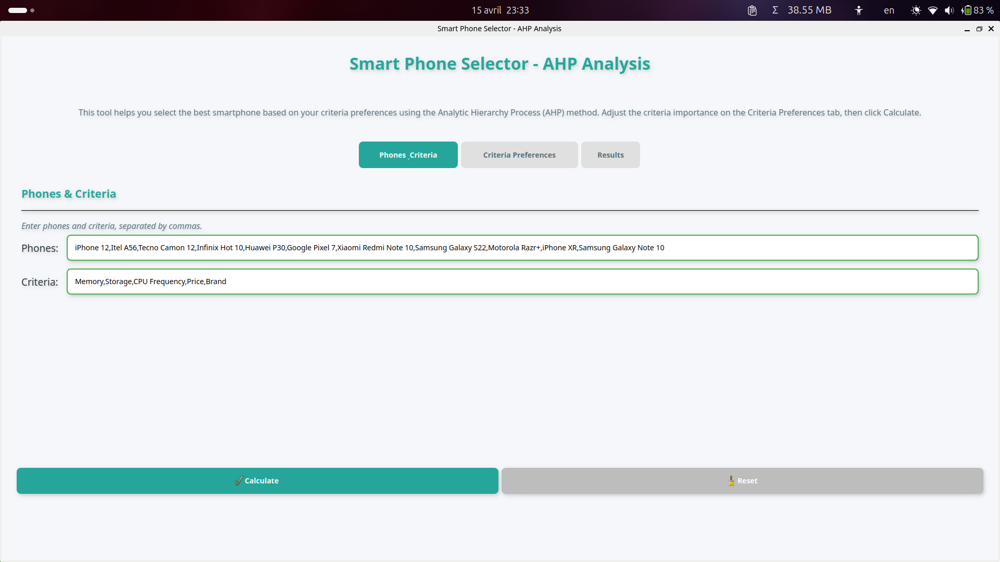
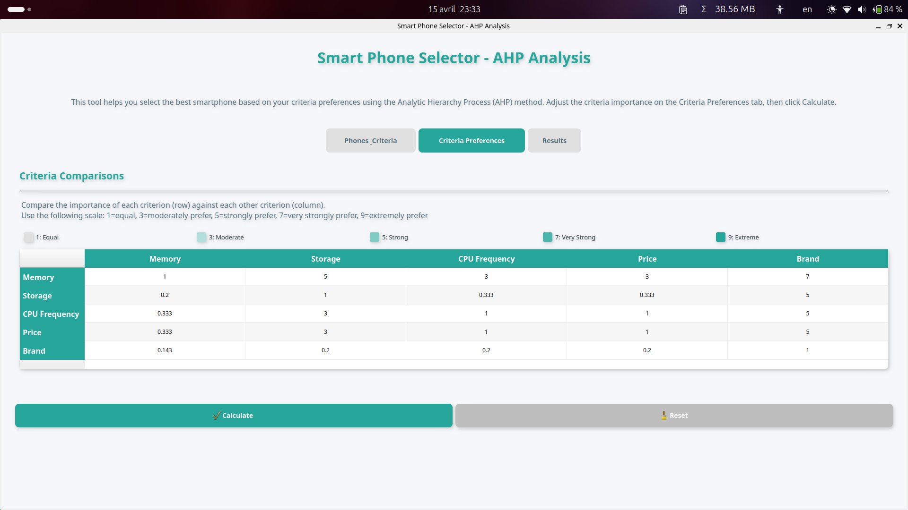
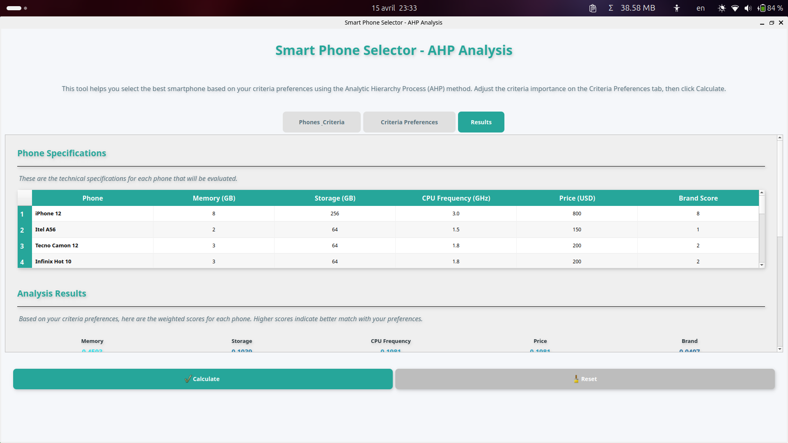
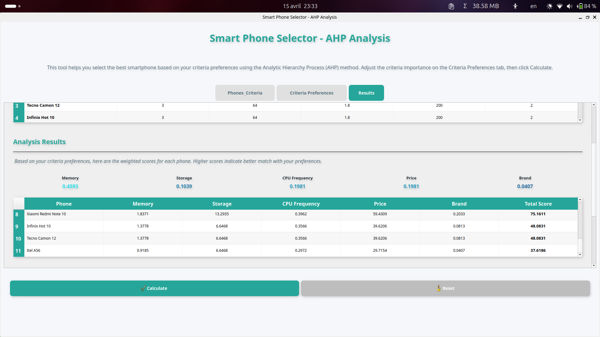
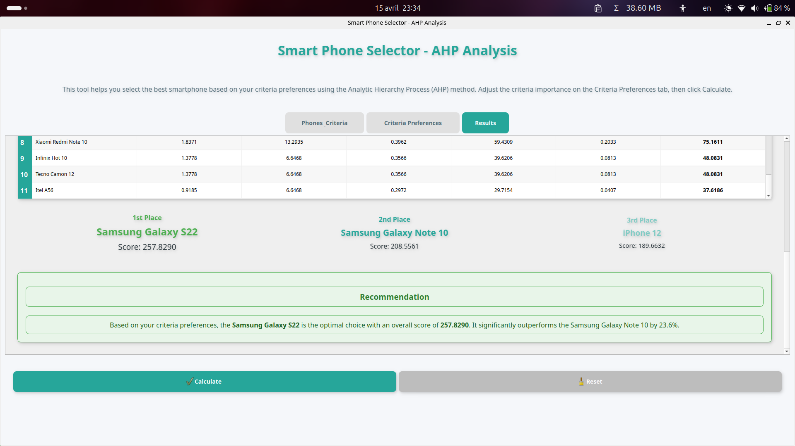

# Smart Phone Selector - AHP Analysis

## Overview

This application helps users select the optimal smartphone based on their preferences using the Analytic Hierarchy Process (AHP) methodology. The Smart Phone Selector breaks down complex smartphone selection_decisions into manageable comparisons of different criteria such as memory, storage, CPU frequency, price, and brand preference.

## Features

- **Multi-criteria Decision Analysis**: Evaluate phones across 5 key criteria
- **User-defined Preferences**: Customize the importance of each criterion
- **Interactive Interface**: Modern UI with visual feedback and intuitive controls
- **Comprehensive Results**: Detailed scores with visual comparisons and recommendations
- **Consistency Checking**: Validates preference consistency using AHP methodology

## Screenshots







## How It Works

The application implements the Analytic Hierarchy Process through these steps:

1. **Define Alternatives & Criteria**: Select from pre-loaded smartphones and evaluation criteria
2. **Set Criteria Preferences**: Use pairwise comparisons to establish relative importance
3. **Analyze Specifications**: Review technical specifications of each phone
4. **Calculate Scores**: Process the_data using AHP mathematical model
5. **Generate Recommendations**: View ranked results with visual indicators

## Installation

### Prerequisites

- Python 3.6+
- PyQt5
- NumPy

### Setup

```bash
# Clone the repository
git clone https://github.com/gedeontiga/project_0_ahp.git
cd project_0_ahp

# Install required packages
pip install -r requirements.txt

# Run the application
python main.py
```

## Usage Guide

### 1. Phones & Criteria Tab

The application comes pre-loaded with 11 popular smartphone models and 5 common evaluation criteria. You can customize these by editing the comma-separated values in the input fields.

### 2. Criteria Preferences Tab

Adjust the importance of each criterion relative to others using the comparison matrix:

- **1**: Equal importance
- **3**: Moderate importance
- **5**: Strong importance
- **7**: Very strong importance
- **9**: Extreme importance
- Values less than 1 (e.g., 0.333) indicate the inverse relationship

The color coding provides visual feedback on your preference intensity.

### 3. Results Tab

After clicking "Calculate," you'll see:

- **Specifications Table**: Technical details of all phones
- **Criteria Weights**: Visual representation of how important each criterion is
- **Scores Table**: Detailed breakdown of how each phone performs
- **Top 3 Visualization**: Highlighted presentation of the best options
- **Recommendation**: Summary with percentage_difference between top choices

### 4. Reset or Refine

Use the Reset button to start over, or adjust your criteria preferences and recalculate to refine your results.

## Technical Implementation

- **UI Framework**: Built with PyQt5 for a responsive and modern interface
- **AHP Algorithm**: Implements core AHP functions including:
  - Pairwise comparison normalization
  - Priority weight calculation
  - Consistency ratio checking
  - Alternative scoring
- **Visualization**: Color-coded tables and animated results presentation

## Files

- `main.py`: Main application with UI components
- `ahp_func.py`: Core AHP calculation functions

---

By AMBOMO TIGA GÉDÉON 21T2496
